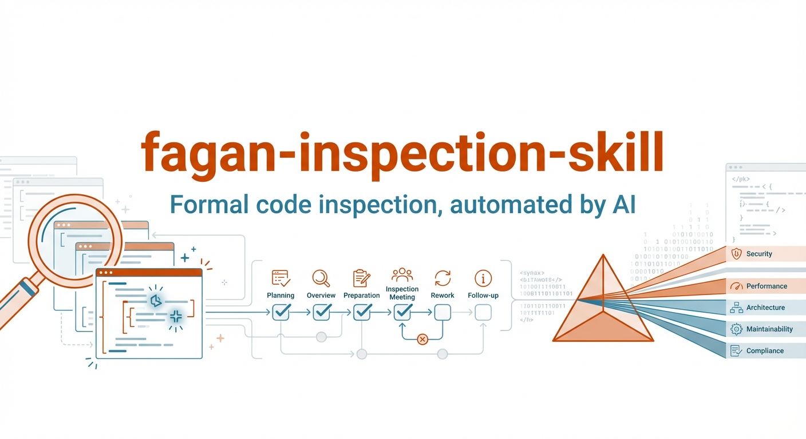

# fagan-inspection-skill

<p align="center">
  <picture>
    <source media="(prefers-color-scheme: dark)" srcset="assets/banner.dark.png" />
    <source media="(prefers-color-scheme: light)" srcset="assets/banner.light.png" />
    
  </picture>
</p>

A formal [Fagan Inspection](https://en.wikipedia.org/wiki/Fagan_inspection) skill for AI coding assistants. Works with both **Claude Code** and **Codex CLI**.

Given a change set (staged diff, PR, or working tree), the skill walks the AI through all five Fagan phases -- scoping, planning, domain reviews, synthesis, and rework -- and produces a structured **Fagan Inspection Report** with a prioritized defect log.

## Skills included

| Skill | What it does |
|---|---|
| **`fagan-inspection`** | Core inspection. Outputs a Fagan report + defect log. No external dependencies. |
| **`fagan-inspection-beads`** | Optional add-on. Runs the full inspection, then creates [Beads](https://github.com/steveyegge/beads) issues from the defect log so defects become trackable tasks with priorities and dependencies. |

## Features

- Automatic scope detection from git context (staged diff, PR range, working tree)
- Dynamic domain selection (security, performance, correctness, tests, etc.)
- Parallel domain reviewers when subagents are available
- Consolidated defect log with severity, location, fix, and verification steps
- Entry/exit criteria enforcement
- Works as explicit-only skills (no accidental triggers)
- **Beads add-on:** defects become trackable issues with parent-child linking, priority mapping (MAJOR->P0, MINOR->P2), and structured acceptance criteria

## Install

### Option A: Install for Codex from GitHub

Codex installs skills into `~/.codex/skills`. If you already have the preinstalled `skill-installer` system skill, install both skills directly from GitHub:

```bash
python ~/.codex/skills/.system/skill-installer/scripts/install-skill-from-github.py \
  --repo 45ck/fagan-inspection-skill \
  --path .agents/skills/fagan-inspection \
  --path .agents/skills/fagan-inspection-beads
```

Restart Codex after installation so the new skills appear in `/skills`.

### Option B: Clone into your project

```bash
# From your project root
git clone https://github.com/45ck/fagan-inspection-skill.git /tmp/fagan-skill
cp -r /tmp/fagan-skill/.claude .claude
cp -r /tmp/fagan-skill/.agents .agents
```

### Option C: Install globally (user-level)

```bash
git clone https://github.com/45ck/fagan-inspection-skill.git
cd fagan-inspection-skill
bash install.sh
```

To remove:

```bash
bash uninstall.sh
```

## Usage

### Claude Code

```
/fagan-inspection
/fagan-inspection focus on auth module and SQL queries

/fagan-inspection-beads
/fagan-inspection-beads --include-minor
```

### Codex CLI

```
$fagan-inspection
$fagan-inspection review auth and billing changes

$fagan-inspection-beads
$fagan-inspection-beads --include-minor
```

## What you get

### Core skill: Fagan Inspection Report

| Section | Contents |
|---|---|
| Scope | What changed and why (from chat context or git) |
| Entry/Exit Criteria | Conditions that must hold before and after inspection |
| Overview | High-level summary and top risks |
| Defect Log | Table: ID, Severity, Domain, Location, Title, Status, Fix/Next |
| Rework Summary | What was fixed (if the AI had write permissions) |
| Verification | Commands and tests that confirm fixes |

### Beads add-on: additional output

| Section | Contents |
|---|---|
| Status | Whether Beads was initialized, already present, or skipped |
| Parent bead | The grouping issue for this inspection run |
| Created defect beads | Table: Bead ID, Severity, Defect Title, Priority |
| Skipped defects | MINOR defects omitted unless `--include-minor` was passed |
| Next actions | Output of `bd ready --json` |

The Beads add-on gracefully degrades: if `bd` is not installed, it outputs the full inspection report and prints install instructions instead of failing.

## Repo structure

```
.claude/skills/
  fagan-inspection/SKILL.md              # Claude Code: core skill
  fagan-inspection-beads/SKILL.md        # Claude Code: Beads add-on
.agents/skills/
  fagan-inspection/
    SKILL.md                             # Codex CLI: core skill
    agents/openai.yaml                   # Codex metadata
  fagan-inspection-beads/
    SKILL.md                             # Codex CLI: Beads add-on
    agents/openai.yaml                   # Codex metadata
install.sh                               # Global install (Claude + Codex ~/.codex/skills)
uninstall.sh                             # Global uninstall
LICENSE                                  # MIT
```

## How it works

The Fagan Inspection is a structured code review process created by Michael Fagan at IBM in 1976. Unlike casual code review, it follows a defined process:

1. **Planning** -- define entry/exit criteria, select review domains
2. **Overview** -- summarize the change set and intent
3. **Preparation** -- each reviewer independently examines the code for their domain
4. **Inspection meeting** -- reviewers compare findings, de-duplicate, and prioritize
5. **Rework** -- defects are fixed and verified against exit criteria

This skill encodes that entire process as AI-executable instructions, so the assistant performs a rigorous, multi-perspective review rather than a single-pass skim.

### Beads integration

[Beads](https://github.com/steveyegge/beads) provides persistent, structured memory for coding agents. The add-on skill maps the inspection's defect log to Beads issues:

- One **parent issue** per inspection run (groups all defects)
- One **child issue** per defect (linked via `bd dep add`)
- MAJOR defects get P0 priority, MINOR defects get P2 (opt-in with `--include-minor`)
- Each issue gets structured fields: description (what/why), notes (domain/location/evidence), acceptance criteria (verification steps)
- Initializes Beads in `--stealth` mode by default so it doesn't commit metadata to your repo

## Related

- [hci-review-skill](https://github.com/45ck/hci-review-skill) -- Structured HCI and UX prototype review skills: conceptual models, state machines, journey maps, vocabulary audits, heuristic evaluations, cognitive walkthroughs, and more

## License

[MIT](LICENSE)
